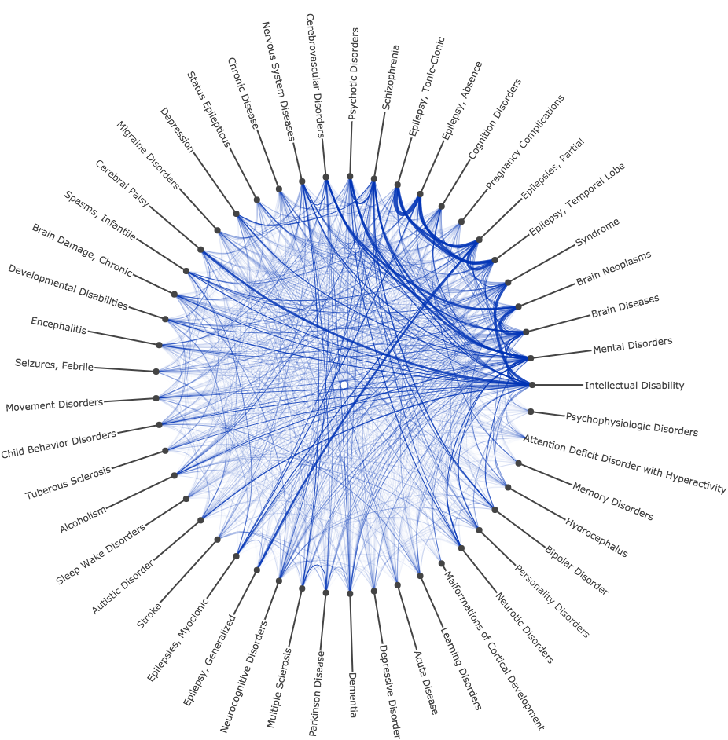
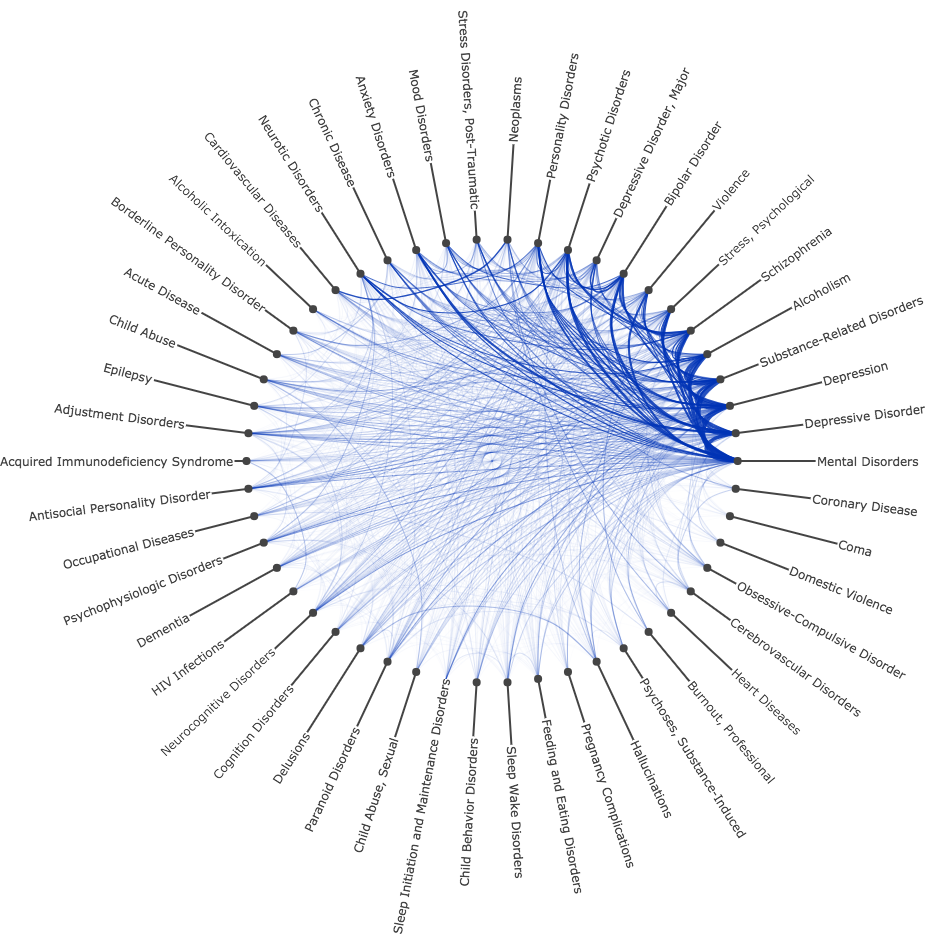
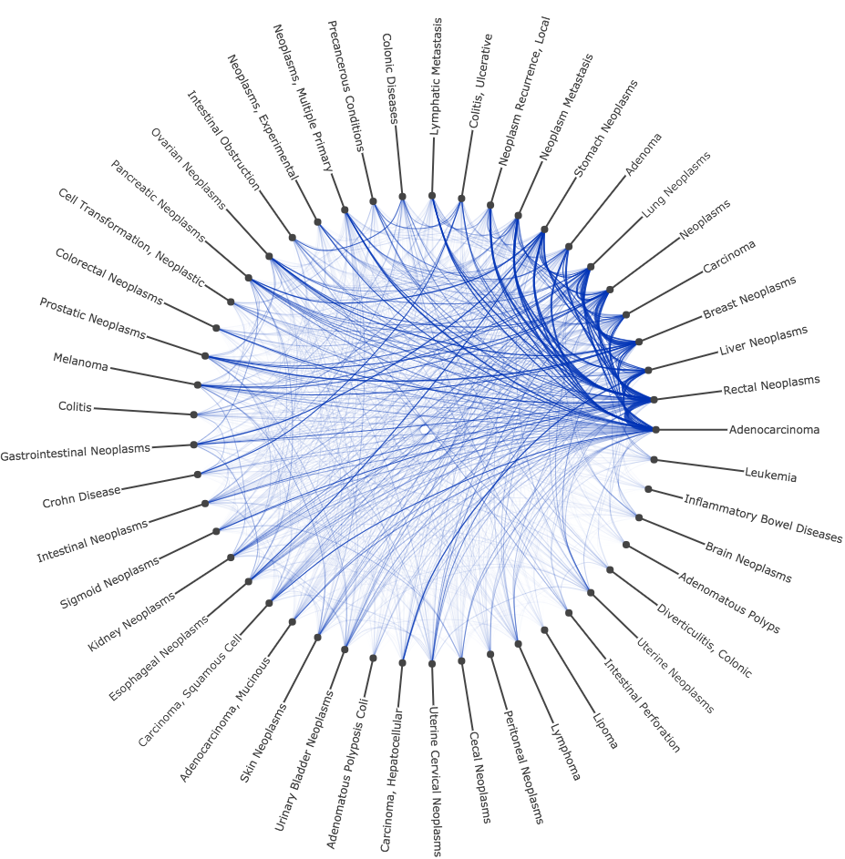

# Sample (PubMed) Comorbidity Studies

This repository contains Jupyter notebooks that uses tools and pipelines developed in Julia at Brown's Center for BioMedical Informatics to explore comorbidities in PubMed Articles

## Brown Databases

If you are a Brown reaseracher, teh studies can be run faster by accessing Brown's databases. You will need to have select access to the following schemas on BCBI's database server. (For more information or help setting up your user, contact us)

In this case there are three available examples comorbitidy studies presented via Jupyter notebooks:

| Epilepsy   |      Suicide      |  Colonic Neoplasmas |
|:----------:|:-------------:|:------:|
| |   |  |

| Epilepsy   |
|:----------:|
| | 

|      Suicide  | 
|:-------------:|
|   | 

|  Colonic Neoplasmas |
|:----------:|
|  |
    

## Local Resources

The studies can also be run on your local workstationg by querying the ENTERZ and UMLS APIs and using related Julia packages such us BioMedQuery. Basic Julia scripts are provided under local_databases directory. Related Jupyter Notebooks are coming soon
