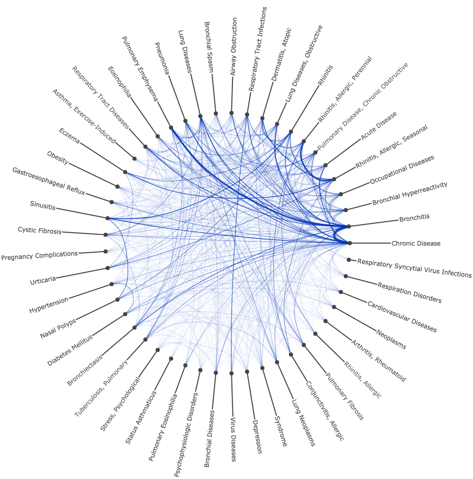

# PubMed Comorbidity Studies

This repository contains [Julia](https://julialang.org) scripts and Jupyter notebooks that use tools and pipelines developed at The Brown's Center for Biomedical Informatics to explore comorbidities in PubMed articles

## Brown Databases

If you are a Brown researcher, the studies can be run faster by accessing Brown's databases. You will need to have `SELECT` rights to the following schemas on BCBI's database server:
* medline
* umls_meta
* pubmed_miner

For more information or help setting up your user, contact us.

### Julia Package Dependencies:

#### Unregistered:
* PubMedMiner.jl - `Pkg.clone("https://github.com/bcbi/PubMedMiner.jl.git")`
* ARules.jl - `Pkg.clone("https://github.com/bcbi/ARules.jl.git")`
* BCBIStats.jl - `Pkg.clone("https://github.com/bcbi/BCBIStats.jl.git")`
* PlotlyJSFactory - `Pkg.clone("https://github.com/mirestrepo/PlotlyJSFactory.jl.git")`

#### Registered:
* DataTables.jl - `Pkg.add("DataTables")`
* FreqTables.jl - `Pkg.add("FreqTables")`
* PlotlyJS.jl - `Pkg.add("PlotlyJS")` 
    * If Sankey Diagram is not available, checkout master: `Pkg.checkout("PlotlyJS")`
* NamedArrays.jl - `Pkg.add("PlotlyJS")`
* StatsBase.jl - - `Pkg.add("StatsBase")`
* Revise.jl (optional) - `Pkg.add("Revise")`

Three examples of comorbitidy studies are presented via Jupyter notebooks and included in the subdirectory [brown_databases](https://github.com/bcbi/PubMedMiner.jl/tree/master/comorbidity_studies/brown_databases). For reproducing the results, download the notebooks. To view the studies, use the following links which are rendered via nbviewer (github does does not render the plots)

### Examples of Exploratory Studies
| [Epilepsy](http://nbviewer.jupyter.org/github/bcbi/PubMedMiner.jl/blob/master/comorbidity_studies/brown_databases/epilepsy_comorbidities.ipynb)   |      [Asthma](http://nbviewer.jupyter.org/github/bcbi/PubMedMiner.jl/blob/master/comorbidity_studies/brown_databases/asthma_comorbidities.ipynb)      |  [Colonic Neoplasmas](http://nbviewer.jupyter.org/github/bcbi/PubMedMiner.jl/blob/master/comorbidity_studies/brown_databases/colonic_neoplasms_comorbidities.ipynb) |
|:----------:|:-------------:|:------:|
| |   |  |
   

## Local Resources

The studies can also be run on your local workstationg by querying the ENTERZ and UMLS APIs and using related Julia packages such us BioMedQuery. Basic Julia scripts are provided under [local_databases](https://github.com/bcbi/PubMedMiner.jl/tree/master/comorbidity_studies/local_databases) directory. Related Jupyter Notebooks are coming soon
